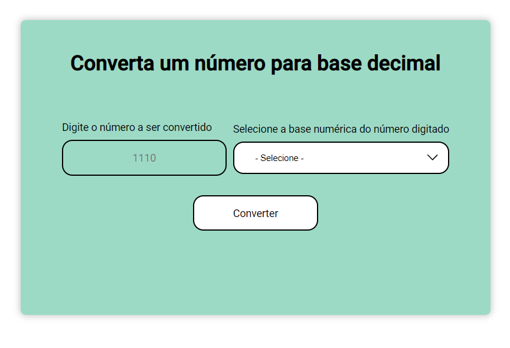

## Conversor de bases numéricas

Solução simples para exercitar o uso de DOM

### Design

;

### Link

- URL: [Acess here](https://deborabrum.github.io/number-to-dec/)

### Tecnologias utilizadas

- HTML
- CSS
- Javascript
